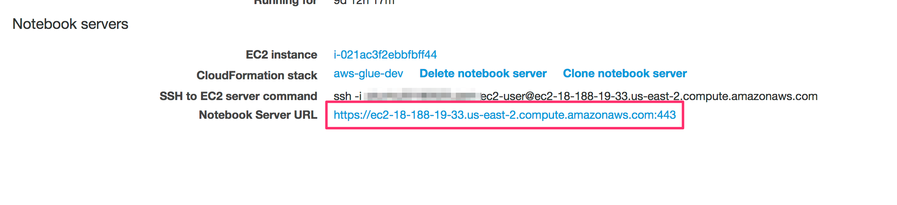
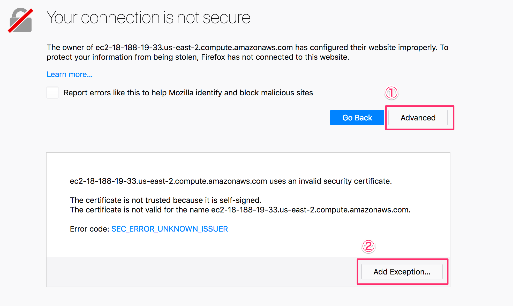
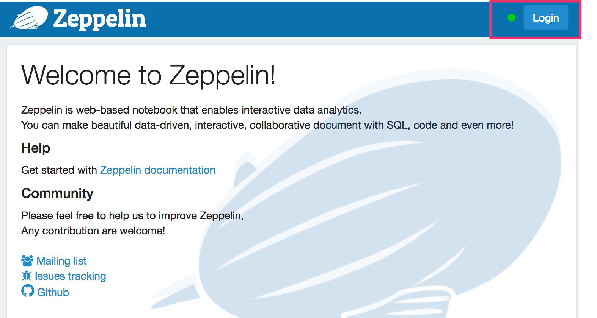
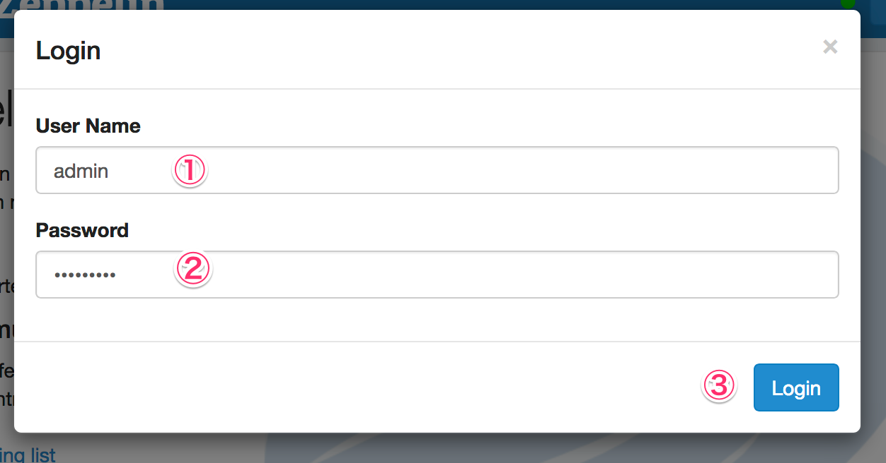
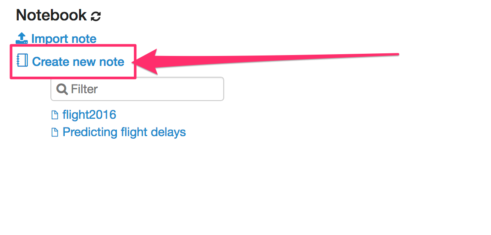
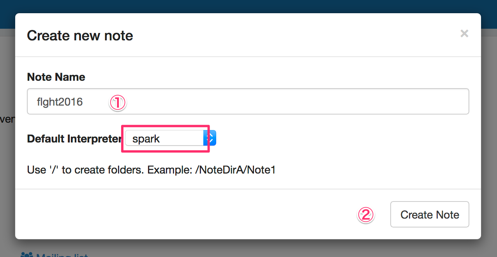
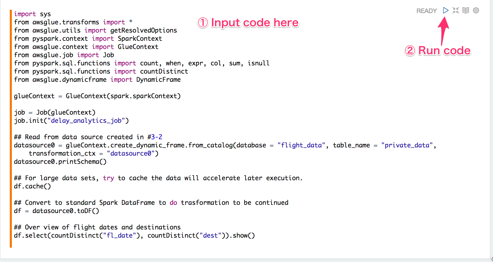
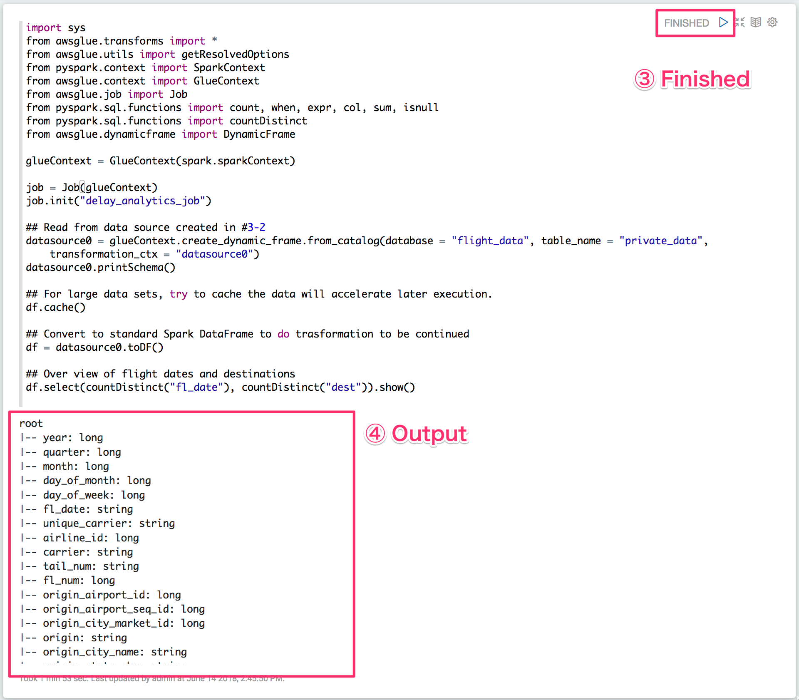
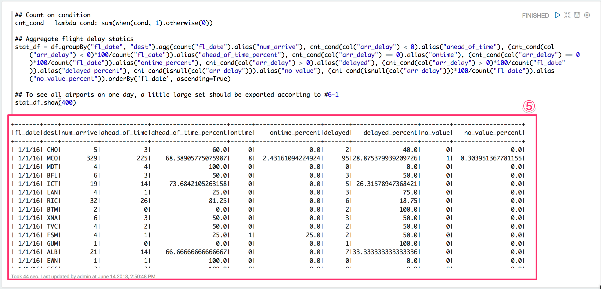
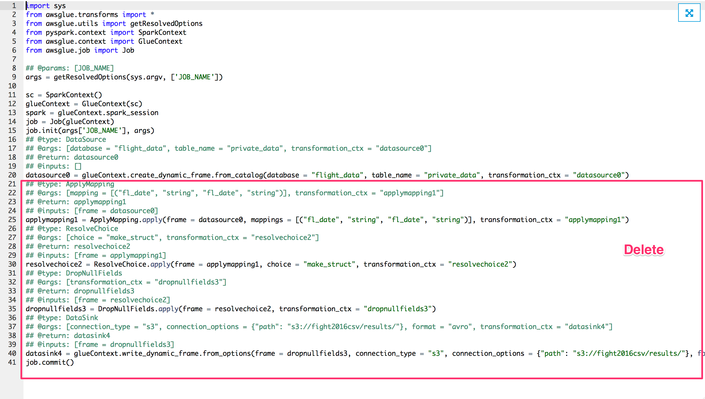

# AWS Glue Hands-On

# 1. Prepare the environment

## 1-0. Fetch the hands-on contents
```
git clone git@github.com:komushi/aws-glue-study.git
```

## 1-1. Create the S3 bucket <your_workshop_bucket>
**Use the AWS management console or AWS CLI**

* Service -> S3 -> Create Bucket => <your_workshop_bucket>
* Create a folder 'cfn' under <your_workshop_bucket>
```
<your_workshop_bucket>/
  +-- cfn
```

## 1-2. Edit the local 'cfn/master.yaml'
* Resources.VPCStack.Properties.TemplateURL => https://<your_workshop_bucket>.s3.amazonaws.com//vpc.yaml
* Resources.IAMStack.Properties.TemplateURL => https://<your_workshop_bucket>.s3.amazonaws.com/iam.yaml
* Resources.SecurityGroupStack.Properties.TemplateURL => https://<your_workshop_bucket>.s3.amazonaws.com/sg.yaml

## 1-3. Upload the local folder 'cfn' to s3://<your_workshop_bucket>/cfn/

## 1-4. Create the Glue environment by CloudFormation
* Service -> CloudFormation -> Create new task
* Select template -> Specify an Amazon S3 template URL => https://<your_workshop_bucket>.s3.amazonaws.com/master.yaml
* Stack name: aws-glue-study
* Input proper UserName and UserPassword
* Check on: I acknowledge that AWS CloudFormation might create IAM resources with custom names.
* Wait until status changed to "CREATE_COMPLETE"

**You will see stacks like:**
```
aws-glue-study-SecurityGroupStack-XXXXXXXXXXXXX [NESTED]
aws-glue-study-IAMStack-XXXXXXXXXXXX [NESTED]
aws-glue-study-VPCStack-XXXXXXXXXXXX [NESTED]
aws-glue-study
```

# 2. Play with the public data

## 2-1. Crawl the public data by creating a table - flight_data.csv - by the AWS Glue Crawlers GUI
* Service -> AWS Glue -> Crawlers -> Add Crawler
* Crawler name: crawl_public_flight_csv
* Data store: s3://crawler-public-ap-northeast-1/flight/2016/csv/
* Choose an existing IAM role: aws-glue-study-IAMStack-XXXXXX-AWSGlueServiceRole-XXXXXXXXXXXX
* Frequency: Run on demand
* Output Database: flight_data
* Prefix added to tables: public_
* Run the crawler

## 2-2. Query the data at Athena
* Service -> Athena -> Execute query

```
select count(1) from public_csv
```

# 3. Import into private s3 bucket as csv

## 3-1. Run ETL Job into private csv data on S3 by the AWS Glue Jobs GUI

* Service -> AWS Glue -> Jobs -> Add job
* Name: job_import_csv
* IAM Role: aws-glue-study-IAMStack-XXXXXX-AWSGlueServiceRole-XXXXXXXXXXXX
* This job runs: A proposed script generated by AWS Glue
* ETL language: Python
* Script file name: job_import_csv
* S3 path where the script is stored: s3://<your_workshop_bucket>/scripts
* Data source:  flight_data.public_csv
* Data target: Create tables in your data target
```
Data store: Amazon S3
Format: CSV
Compression type: gzip
Target path: s3://<your_workshop_bucket>/flight_csv/
```
* Save job and edit scripts
* Run job

## 3-2. Crawl to create a table - flight_data.private_csv
* Service -> AWS Glue -> Crawlers -> Add Crawler
* Crawler name: crawl_private_flight_csv
* Data store: s3://<your_workshop_bucket>/flight_csv/
* Choose an existing IAM role: aws-glue-study-IAMStack-XXXXXX-AWSGlueServiceRole-XXXXXXXXXXXX
* Frequency: Run on demand
* Output Database: flight_data
* Prefix added to tables: private_
* Run the crawler

## 3-3. Query the data

* Service -> Athena -> Query editor

```
select count(1) from private_flight_csv
```

# 4. ETL to Parquet

## 4-1. Run ETL Job to convert flight_data.private_flight_csv parquet

* Service -> AWS Glue -> Jobs -> Add job
* Name: job_conver_to_parquet
* IAM Role: aws-glue-study-IAMStack-XXXXXX-AWSGlueServiceRole-XXXXXXXXXXXX
* This job runs: A proposed script generated by AWS Glue
* ETL language: Python
* Script file name: job_import_csv
* S3 path where the script is stored: s3://<your_workshop_bucket>/scripts
* Data source:  flight_data.private_flight_csv
* Data target: Create tables in your data target
```
Data store: Amazon S3
Format: Parquet
Target path: s3://<your_workshop_bucket>/flight_parquet/
```
* Save job and edit scripts
* Run job

## 4-2. Crawl to create a table - flight_data.flight_parquet
* Service -> AWS Glue -> Crawlers -> Add Crawler
* Crawler name: crawl_private_flight_parquet
* Data store: s3://<your_workshop_bucket>/flight_parquet/
* Choose an existing IAM role: aws-glue-study-IAMStack-XXXXXX-AWSGlueServiceRole-XXXXXXXXXXXX
* Frequency: Run on demand
* Output Database: flight_data
* Prefix added to tables: private_
* Run the crawler

## 4-3. Query the data
* Service -> Athena -> Execute query

```
select count(1) from private_flight_parquet
```

# 5. Setup managed Zeppelin notebook envrironment

## 5-0. Create Development Eendpoint
* Service -> AWS Glue -> Dev endpoints -> Add endpoint
```
    Development endpoint name: type as you want
    IAM Role: chooose existing Glue IAM role which was created by Cfn
    Networking: choose "Choose a VPC, subnet, and security groups". Then specify appropriate subnet/security group accordingly
    Public key contents: choose "Create SSH Key". Then download private-key file (.pem) to your local PC
```
* Press Finish

## 5-1. Create Zeppelin notebook server
* Dev endpoints -> Action -> Create notebook server
* Input notebook parameters as below:

```
  CloudFormation stack name: aws-glue-[your-name-and-date]
  IAM Role: choose the one which name includes "AWSGlueNotebookRule"
  EC2 key pair: use any of existing or just create a new one
  SSH private key: press Upload button to choose the private-key.pem
  Notebook username: admin
  Notebook password: type as you want
```
* Leave all other parameters as default and press Finish
* Service -> CloudFormation -> Stack
* Check if the Zeppelin notebook server is being created, and wait until finished (it may takes a few minutes)

## 5-2. Connect to the Zeppelin
* Service -> AWS Glue -> Dev endpoints -> myDevEndpoint
* Check if your new instance is now listed under Notebook servers pane

# 6. Develop custom ETL script using Zeppelin notebook
## 6-0. Login to Zeppelin notebook
* Wait until notebook EC2 instance is ready (Can be checked under EC2 instances)
* Open the link at the bottom of "myDevEndpoint" detail page

* "Your connection is not secure" may be displayed with Firefox browser

```
Advanced -> Add Exception... -> Confirm Secure Exception
```

* Login (Top right corner of page) -> input username / password set in #5-2 -> Logged in -> Create new note




## 6-1. Extract data and quick explore
* Execute code below

```
import sys
from awsglue.transforms import *
from awsglue.utils import getResolvedOptions
from pyspark.context import SparkContext
from awsglue.context import GlueContext
from awsglue.job import Job
from pyspark.sql.functions import count, when, expr, col, sum, isnull
from pyspark.sql.functions import countDistinct
from awsglue.dynamicframe import DynamicFrame

glueContext = GlueContext(spark.sparkContext)

job = Job(glueContext)
job.init("delay_analytics_job")

## Read from data source created in #3-2
datasource0 = glueContext.create_dynamic_frame.from_catalog(database = "flight_data", table_name = "private_data", transformation_ctx = "datasource0")
datasource0.printSchema()

## Convert to standard Spark DataFrame to do trasformation to be continued
df = datasource0.toDF()

## For large data sets, try to cache the data will accelerate later execution.
df.cache()

## Over view of flight dates and destinations
df.select(countDistinct("fl_date"), countDistinct("dest")).show()
```



## 6-2. Transform to get insight of delay statics
* In order to analyse the arrived delay statics in all days of airports, let us try to aggregate the all the airport on each day, by counting the airplanes arrived ahead of time, ontime or delayed

```
## Count on condition
cnt_cond = lambda cond: sum(when(cond, 1).otherwise(0))

## Aggregate flight delay statics
stat_df = df.groupBy("fl_date", "dest").agg(count("fl_date").alias("num_arrive"), cnt_cond(col("arr_delay") < 0).alias("ahead_of_time"), (cnt_cond(col("arr_delay") < 0)*100/count("fl_date")).alias("ahead_of_time_percent"), cnt_cond(col("arr_delay") == 0).alias("ontime"), (cnt_cond(col("arr_delay") == 0)*100/count("fl_date")).alias("ontime_percent"), cnt_cond(col("arr_delay") > 0).alias("delayed"), (cnt_cond(col("arr_delay") > 0)*100/count("fl_date")).alias("delayed_percent"), cnt_cond(isnull(col("arr_delay"))).alias("no_value"), (cnt_cond(isnull(col("arr_delay")))*100/count("fl_date")).alias("no_value_percent")).orderBy('fl_date', ascending=True)

## To see all airports on one day, a little large set should be exported accorting to #6-1
stat_df.show(400)
```


## 6-3. Export transformed data to data sinks in kinds of formats for Loading to data consumers.
* Service -> S3 -> <your_workshop_bucket> -> Add folder -> "results"
* Convert DataFrame back to DynamicFrame for exporting transformed data to data sink, such as S3 bucket.
* Try to change the format to the one you want to export
```
stat_dyf = DynamicFrame.fromDF(stat_df, glueContext, "stat_dyf")
## Case 1: Write to CSV
datasink1 = glueContext.write_dynamic_frame.from_options(frame = stat_dyf, connection_type = "s3", connection_options = {"path": "s3://<your_workshop_bucket>/results/", "compression": "gzip"}, format = "csv", transformation_ctx = "datasink1")
## Case 2: Write to parquet
datasink2 = glueContext.write_dynamic_frame.from_options(frame = stat_dyf, connection_type = "s3", connection_options = {"path": "s3://<your_workshop_bucket>/results/"}, format = "parquet", transformation_ctx = "datasink2")
## Case 3: Write to orc
datasink3 = glueContext.write_dynamic_frame.from_options(frame = stat_dyf, connection_type = "s3", connection_options = {"path": "s3://<your_workshop_bucket>/results/"}, format = "orc", transformation_ctx = "datasink3")
job.commit()
```
* Go to S3 to check under results folder, files should be here.
* The transformed data can be loaded to kinds of data consumers like QuickSight, Athena, etc.

# 7. Create a Glue job to do the ETL job automatically
* What is the purpose of this section?

* Service -> AWS Glue -> Jobs -> Add job
* Name: job_delay_stat_etl
* IAM Role: AWSGlueServiceRole created by CloudFormation:
```
aws-glue-study-IAMStack-XXXXXX-AWSGlueServiceRole-XXXXXXXXXXXX
```
* Script: Use the proposed script by AWS Glue:
```
  ◉ A proposed script generated by AWS Glue
  ◉ Python
```
* Script file name: job_delay_stat_etl
* S3 path where the script is stored

```
  s3://<your_workshop_bucket>/scripts/               # Created at 3-0
```
* Data source: private_data
* Data target: Create a gzip-compressed CSV table in your own S3 table

```
 ◉ Create tables in your data target
    Data store: Amazon S3
    Format: Avro
    Target path: s3://<your_workshop_bucket>/results/   # Created at 6-3
```
* Map the source columns to target columns > Delete all the maps except "fl_date"
* Save job and edit scripts
 1. Delete auto generated code in red rectangle

 2. Add necessary code developed in 6. as follows

```
...

from pyspark.sql.functions import count, when, expr, col, sum, isnull
from pyspark.sql.functions import countDistinct
from awsglue.dynamicframe import DynamicFrame

...

## Convert to standard Spark DataFrame to do trasformation to be continued
df = datasource0.toDF()

## For large data sets, try to cache the data will accelerate later execution.
df.cache()

## Count on condition
cnt_cond = lambda cond: sum(when(cond, 1).otherwise(0))

## Aggregate flight delay statics
stat_df = df.groupBy("fl_date", "dest").agg(count("fl_date").alias("num_arrive"), cnt_cond(col("arr_delay") < 0).alias("ahead_of_time"), (cnt_cond(col("arr_delay") < 0)*100/count("fl_date")).alias("ahead_of_time_percent"), cnt_cond(col("arr_delay") == 0).alias("ontime"), (cnt_cond(col("arr_delay") == 0)*100/count("fl_date")).alias("ontime_percent"), cnt_cond(col("arr_delay") > 0).alias("delayed"), (cnt_cond(col("arr_delay") > 0)*100/count("fl_date")).alias("delayed_percent"), cnt_cond(isnull(col("arr_delay"))).alias("no_value"), (cnt_cond(isnull(col("arr_delay")))*100/count("fl_date")).alias("no_value_percent")).orderBy('fl_date', ascending=True)

stat_dyf = DynamicFrame.fromDF(stat_df, glueContext, "stat_dyf")
datasink4 = glueContext.write_dynamic_frame.from_options(frame = stat_dyf, connection_type = "s3", connection_options = {"path": "s3://fight2016csv/results/"}, format = "avro", transformation_ctx = "datasink4")
job.commit()
```

* Save and Run job

# Public data used
* https://s3.console.aws.amazon.com/s3/buckets/crawler-public-ap-northeast-1/flight/
* s3://crawler-public-ap-northeast-1/flight/2016/csv/
